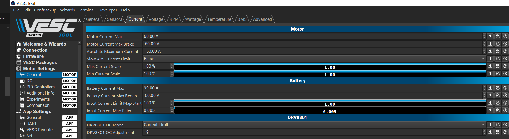

# この教材のダウンロード

## レポジトリをcloneする方法

### GitHub CLIのインストール

#### ターミナルをインストールする

[Windows ターミナルをインストールしてセットアップを開始する](https://learn.microsoft.com/ja-jp/windows/terminal/install)

#### GitHub CLIをインストールする

[Installation](https://github.com/cli/cli#installation)

### GitHub CLIでレポジトリをcloneする

[GitHub CLI クイックスタート](https://docs.github.com/ja/github-cli/github-cli/quickstart)

1. ターミナルを開く
2. この教材のレポジトリをcloneする

```
gh repo clone https://github.com/shima-nct/TutorialsForHelperBoardForPIUSDevelopment.git
```

# Arduiono

## Arduinoとは
Arduinoは、マイコンボードの一種で、主に電子工作やIoT（インターネット・オブ・スクリーン）の開発に使用されます。Arduinoは、プログラミングを学ぶ初心者でも扱いやすい環境を提供しており、多くのプログラマーや電子工作愛好家にとって人気のある製品です。

## Arduino IDE  
Arduino IDEは、Arduinoの開発環境を提供するソフトウェアです。

[Download and install Arduino IDE](https://support.arduino.cc/hc/en-us/articles/360019833020-Download-and-install-Arduino-IDE)

## Arduino IDEでプログラムを書く

Arduinodではプログラムの主となるコードファイルの事を「スケッチ」と呼びます。
プログラミング言語はC++ですが、このスケッチファイルは伝統的に「.ino」の拡張子を用いています。

C++言語での開発と同様にスケッチ以外のファイルにコードを分割して記述することができます。この分割するファイルの拡張子は一般的なC++言語による開発と同様に「.cpp」または「.h」で、扱いも同じです。

## Arduino IDEの「スケッチの例」

Arduino IDEにスケッチのサンプルが「スケッチの例」メニューに配置されています。
このサンプルはボードサポートやライブラリ毎にも用意されている場合があるので、それらをインストールする毎に「スケッチの例」メニューに追加されて行きます。

## M5Stackのボードサポートの追加
VESCサポートボードに搭載されているマイコンモジュールはM5Stamp C3Uです。このマイコンモジュールはEspressif [ESP32C3](https://docs.m5stack.com/en/core/stamp_c3u) というマイコンを搭載しています。

Arduino IDEでこのマイコンのプログラムを開発するために、M5StampC3ボードサポートライブラリを追加する必要があります。

Setting Up the Arduino Development Environment：https://docs.m5stack.com/ja/arduino/arduino_ide

ボードサポートライブラリをインストールした後、ボードをUSBケーブルで接続し、ボードタイプとしてM5StampC3を設定します。この際に、M5StampC3のボードタイプは二つ現れます。一つはM5Stamp C3UのメーカーであるM5Stackが提供するボードタイプで、もう一つはマイコンチップであるESP32C3のメーカーであるEspressifが提供するボードタイプです。どちらを選ぶか状況により異なりますが、ここではM5Stamp C3UのメーカーであるM5Stackが提供するボードタイプを選択しましょう。

ESP32の開発環境である[ESP-IDF](https://docs.espressif.com/projects/esp-idf/en/stable/esp32/)のバージョンはv5.4.1（2025-05-12時点）ですが、ボードサポートライブラリに含まれるESP-IDFのバージョンはこれより古いものが同梱されています。Espressif公式のESP32 Arduino Coreに含まれているESP-IDFはv5.1です（2025-05-12時点）。他方、M5Stackが提供するボードサポートライブラリはv4.4（2025-05-12時点）です。このため、ライブラリが想定しているESP-IDFのバージョンと異なる場合、ビルドや実行時にエラーが発生する可能性があります。

## ライブラリのインストール

Arduino IDEのライブラリをインストールする方法

Installing Libraries：https://docs.arduino.cc/software/ide-v1/tutorials/installing-libraries/

## COMポートの設定

Arduino IDEで作ったブログラムをマイコンボードへの書き込みはシリアル通信のCOMポートを介して行われます。
このCOMポートはマイコンを接続する毎に番号が変化していきます。
必ずしもボードに固有の番号がつく訳でもないため、
Arduino IDEのCOMポートを設定する方法を説明します。

WindowsでCOMポートを確認する方法：

1. デバイスマネージャーを起動します。
1. 「ポート（COMとLPT）」を展開します。
1. COMポート番号を確認します。

Arduino IDEでCOMポートを設定する方法：

1. タスクバーの検索ボックスに「デバイスマネージャー」を入力すると「デバイスマネージャーが候補として表示されます。これを起動します。

1. 「ポート（COMとLPT）」を展開します。

1. COMポート番号を確認します。

COMポート番号が目的のボードのものか確認するにはデバイスマネージャーでCOMポートを表示している状態で、ボードのUSBケーブルを挿抜をして現れたり消えたりするを見ましょう。

## Arduinoのシリアルモニター

Arduino IDEのシリアルモニターは、Arduinoボードから送信されたシリアル通信データを表示するツールです。



[Using the Serial Monitor tool](https://docs.arduino.cc/software/ide-v2/tutorials/ide-v2-serial-monitor/)

# VESCヘルパーボード

VESCヘルパーボードは、M5Stamp C3Uのインタフェースボードで、ADC、Qwiic、EYESPI、UART、SDカードスロットを備え、センサー、表示デバイスを簡単に接続できることを目的として設計しました。また、VESCとデイジーチェーンで接続できるCANバスコネクタを二つ備えています。ターミネターのON/OFFが可能なので、CANネットワークの接続場所を自由に選択できます。

VESC Expressと互換のスイッチ、UARTのコネクタ、ピン配置に合わせてあるため、VESC Expressファームウェアを書き込めばVESC Expressとして動作します。

https://oshwlab.com/shima1/esp32c3-can-for-vesc

VESCヘルパーボードは3つのADC入力用コネクタ(CN4～CN6)を備えています。ピンアサインは回路図、基板上のシルクスクリーンを参照してください。各コネクタのセンサー出力はGPIO3～GPIO5に接続されています。

ArduinoだとADCピンを示すA0、A1、……などのマクロが定義されているが、ボードライブラリM5StampC3ではこれらは正しく定義されていません。その為、ADCピンの指定にはGPIOを示すマクロを用いる必要があります。

ESP32C3のADC測定レンジはデフォルトだと0mv-2500mVです。

[Analog to Digital Converter (ADC)](https://docs.espressif.com/projects/esp-idf/en/v4.4/esp32c3/api-reference/peripherals/adc.html)

デフォルトでのI2CバスへのGPIOピンアサインは以下の通りです。
* SDA: GPIO8
* SCL: GPIO9

このピンアサインはドキュメント化されていないので、ボードサポートライブラリのソースコードを確認する必要があります。
```
static const uint8_t SDA = 8;
static const uint8_t SCL = 9;
```
-- <cite>[`arduino-esp32/variants/m5stack_stamp_c3
/pins_arduino.h
`](https://github.com/m5stack/arduino-esp32/blob/master/variants/m5stack_stamp_c3/pins_arduino.h)</cite>

VESCヘルパーボードでのI2CバスへのGPIOピンアサインは以下の通りです。
* SDA: GPIO8
* SCL: GPIO10


-- <cite>[VESCヘルパーボード](https://oshwlab.com/shima1/esp32c3-can-for-vesc)</cite>

VESCヘルパーボードでI2Cバスを使用するには、`Wire.begin()`で以下のようにSDA、SCLピンを指定する必要があります。
```
constexpr uint8_t I2C_SDA = 8;
constexpr uint8_t I2C_SCL = 10;

Wire.begin(I2C_SDA, I2C_SCL);
```

# 受講にあたって必要な物品

1. 開発環境
    - 開発用ノートPC
    - USB Type-Cケーブル x 3
    - Arduino IDE
2. VESCヘルパーボード
    - VESCヘルパーボード x 2
    - M5Stamp C3U x 2
    - サムスロットル（JST PH 3P加工済）
    - SparkFun 7-Segment Serial Display 
    - VESC CAN接続ケーブル（両端JST PH 4Pプラグ）
    - ブレッドボード、ジャンパー線
    - QwiicコネクタDIP変換基板-ピンヘッダハンダ付け済み
    - JST PH 3Pコネクタ
    - JST PH 4Pコネクタ
    - みの虫クリップケーブル
    - テスター（マルチメーター）
    - DSO（デジタルオシロスコープ）
1. VESC
    - VESCもしくはVESC互換ESC
    - 電源 12V以上、5A以上
    - 電源ケーブル　電源とVESCのXT90 Maleコネクタと接続できるもの
    - VESC Express
    - VESC Express - VESC CAN接続ケーブル（JST PH 4Pケーブル）
    - VESC用電源スイッチ
1. モーター
    - モーター
    - モーターVESC接続ケーブル（VESC側4mm FEMALE BULLET connectorに適合するもの）