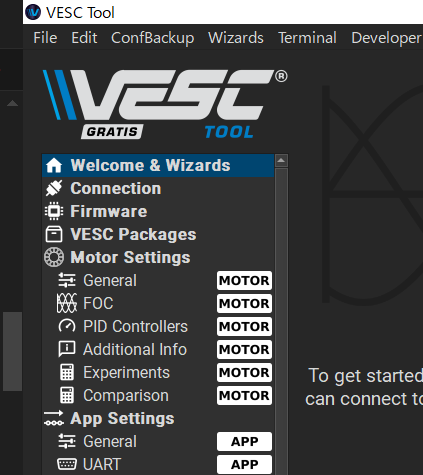
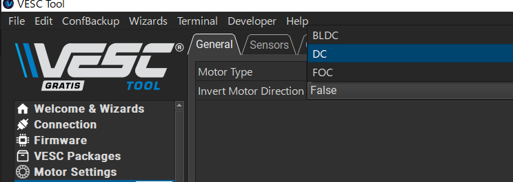

# Arduiono

## Arduinoとは
Arduinoは、マイコンボードの一種で、主に電子工作やIoT（インターネット・オブ・スクリーン）の開発に使用されます。Arduinoは、プログラミングを学ぶ初心者でも扱いやすい環境を提供しており、多くのプログラマーや電子工作愛好家にとって人気のある製品です。

## Arduino IDE  
Arduino IDEは、Arduinoの開発環境を提供するソフトウェアです。

## Arduino IDEのインストール
Arduino IDEのインストール方法を説明します。

## Arduino IDEでプログラムを書く
Arduino IDEでプログラムを書く方法を説明します。

Arduinodではプログラムの主となるコードファイルの事を「スケッチ」と呼びます。
プログラミング言語はC++ですが、このスケッチファイルは伝統的に「.ino」の拡張子を用いています。

C++言語での開発と同様にスケッチ以外のファイルにコードを分割して記述することができます。この分割するファイルの拡張子は一般的なC++言語による開発と同様に「.cpp」または「.h」で、扱いも同じです。

## マイコンにプログラムを書き込む
マイコンにプログラムを書き込む方法を説明します。

## Arduino IDEの「スケッチの例」

# 開発環境

## Arduino IDEのインストール
Arduino IDEのインストール方法を説明します。

Download and install Arduino IDE：https://support.arduino.cc/hc/en-us/articles/360019833020-Download-and-install-Arduino-IDE

## M5Stackのボードサポートの追加
Arduino IDEのボードサポートを追加する方法を説明します。

Setting Up the Arduino Development Environment：https://docs.m5stack.com/ja/arduino/arduino_ide

## ライブラリのインストール
Arduino IDEのライブラリをインストールする方法を説明します。

Installing Libraries：https://docs.arduino.cc/software/ide-v1/tutorials/installing-libraries/

## COMポートの設定
Arduino IDEのCOMポートを設定する方法を説明します。

WindowsでCOMポートを確認する方法：

1. デバイスマネージャーを起動します。
1. 「ポート（COMとLPT）」を展開します。
1. COMポート番号を確認します。

Arduino IDEでCOMポートを設定する方法：

1. タスクバーの検索ボックスに「デバイスマネージャー」を入力すると「デバイスマネージャーが候補として表示されます。これを起動します。

1. 「ポート（COMとLPT）」を展開します。

1. COMポート番号を確認します。

COMポート番号が目的のボードのものか確認するにはデバイスマネージャーでCOMポートを表示している状態で、ボードのUSBケーブルを挿抜をして現れたり消えたりするを見ましょう。

## Arduinoのシリアルモニター

[Using the Serial Monitor tool](https://docs.arduino.cc/software/ide-v2/tutorials/ide-v2-serial-monitor/)

# VESCヘルパーボード

VESCヘルパーボードは、M5Stamp C3Uのインタフェースボードで、ADC、Qwiic、EYESPI、UART、SDカードスロットを備え、センサー、表示デバイスを簡単に接続できることを目的として設計しました。また、VESCとデイジーチェーンで接続できるCANバスコネクタを二つ備えています。ターミネターのON/OFFが可能なので、CANネットワークの接続場所を自由に選択できます。

VESC Expressと互換のスイッチ、UARTのコネクタ、ピン配置に合わせてあるため、VESC Expressファームウェアを書き込めばVESC Expressとして動作します。

https://oshwlab.com/shima1/esp32c3-can-for-vesc