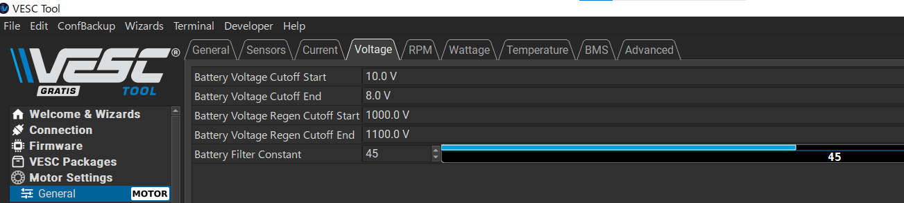
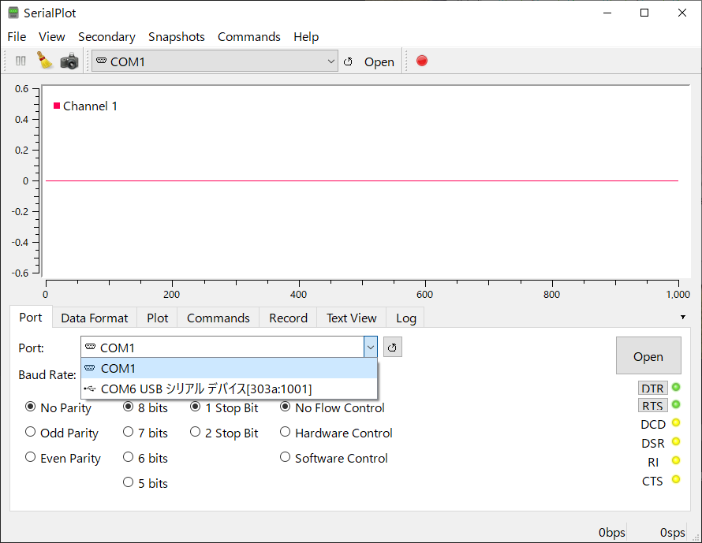
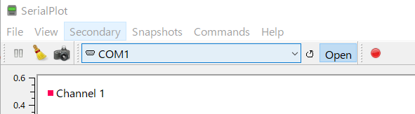
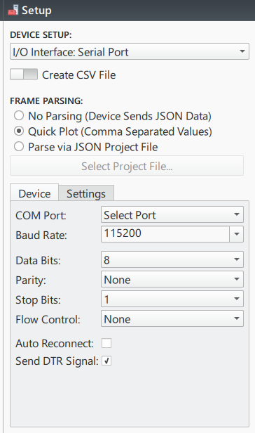
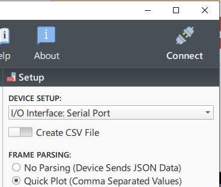

# スロットルの出力電圧を測る
本チュートリアルでは、サムスロットルの基本的な仕組みを理解し、その出力電圧を実際に測定する方法を学びます。また、測定したデータの分析と実用上の課題について考察します。

## サムスロットルの仕組み

サムスロットルは、古くはモペットや原付バイクで見られたアクスル・スロットルの構造です。親指でスロットルレバーを押し込むように操作するので「サム」（親指の意味）スロットルと呼ばれています。バイクではスロットルレバーでアクセルワイヤーを引っ張ることでスロットルを開度を調整し、速度を制御します。

電動バイクではスロットルの押し込み量を電圧で表してESC(Electric Speed Controller)の制御信号として送ります。例をFig.1に示します。[Thumb Throttle](https://www.google.com/search?q=thumb+throttle&sca_esv=bf58db3f14c3f703&rlz=1C1GCEU_jaJP1001JP1001&udm=2&biw=1494&bih=668&sxsrf=AHTn8zr9W1SdJEWDl3p6c-ftJU1HeQTRDA%3A1746741519783&ei=DykdaKfML6nk2roPpsjnuQI&ved=0ahUKEwjnj7Se75SNAxUpslYBHSbkOScQ4dUDCBE&uact=5&oq=thumb+throttle&gs_lp=EgNpbWciDnRodW1iIHRocm90dGxlMgcQABiABBgTMgcQABiABBgTMgcQABiABBgTMgcQABiABBgTMgcQABiABBgTMgcQABiABBgTMgcQABiABBgTMgcQABiABBgTMgcQABiABBgTMgcQABiABBgTMgcQABiABBgTMgcQABiABBgTMgcQABiABBgTMgcQABiABBgTMgcQABiABBgTSNQUUABYtBNwAHgAkAEAmAFhoAGrCaoBAjE0uAEDyAEA-AEBmAIOoALzCcICDRAAGIAEGLEDGIMBGATCAhAQABiABBixAxiDARgEGIoFwgILEAAYgAQYsQMYgwHCAg4QABiABBixAxiDARiKBcICCBAAGIAEGLEDwgIFEAAYgATCAgcQABiABBgEwgIEEAAYHpgDAJIHBDEzLjGgB6wqsgcEMTMuMbgH8wk&sclient=img) で検索すると多く例を見つけることができます。電圧変化を作るのにはPOT（Potentiometer; 可変抵抗）やホールセンサーがよく用いられます。電圧変化の範囲は通常、0Vから5V、12Vなど用途によって異なるので、仕様をよく確認する必要があります。

--<cite>[WUXING 300X THUMB THROTTLE](https://trampaboards.com/resources/images/products/35551.jpg)

#### 質問
1. POTを使ったスロットル開度を電圧に変換する回路はどのようなものですか？

### ホール素子
ホール素子（ホールセンサー、ホールICと呼ばれる場合もあります。）は磁界の強さに応じて電圧を出力する半導体素子です。磁石との距離や向きによって出力電圧が変化する特性を利用して、位置や角度のセンサーとして広く使用されています。

[はじめての人でも分かるホールセンサーの原理と種類](https://emb.macnica.co.jp/articles/10315/)

[Guide to Hall Sensor Throttle operation, testing, and modification.](https://electricbike.com/forum/forum/kits/golden-motor-magic-pie/70584-guide-to-hall-sensor-throttle-operation-testing-and-modification)

#### 質問
1. ホール素子はどのような原理で磁界の強さを電圧に変換していますか？

### スロットルの機構
サムスロットルは、ホール素子と永久磁石を組み合わせた非接触型のポジションセンサーです。スロットルレバーの回転に伴って磁石が動き、その磁界の変化をホール素子が検出することで、スロットル開度を電圧として出力します。

#### 質問
1. スロットルから指を離すとスロットルは元の位置に戻ってきます。どのような機構でこのような動作を実現していますか？
1. スロットルの位置をどうやって磁界強度の変化にしていますか？

### サムスロットルの使い方

#### 配線、電源電圧
ボタンなどが無い単純あサムスロットルには電源（VCC）、グランド（GND）、信号出力（OUT）の3本の配線があります。実験用に用意したサムスロットルは一般的な配線色ルールと異なるので注意が必要です。

POTの場合、電源電圧を間違えてもそう壊れることはありませんが、ホールセンサーの場合は直ちに壊れてしまいます。接続するESCとともに仕様を確認してください。

[FLIPSKY Mini FSESC6.7 PRO 70A base on VESC6.6 With Aluminum Anodized Heat Sink](https://flipsky.net/collections/v6-series/products/mini-fsesc6-7-pro-70a)
[VESC 75V 300A Mk.IV Black Anodised Non Conductive CNC housing](https://trampaboards.com/vesc-75v-300a-mkiv-black-anodised-non-conductive-cnc-housing--300-each-p-36236.html)

VESCヘルパーボード

#### 質問
1. 一般的な電線の色分けのルールは？

[識別標識 (電線)](https://ja.wikipedia.org/wiki/%E8%AD%98%E5%88%A5%E6%A8%99%E8%AD%98_(%E9%9B%BB%E7%B7%9A))

#### コネクタ
サムスロットルのコネクタは、誤接続を防ぐために形状が工夫されています。配線の極性に注意して、確実に接続することが重要です。

VESCヘルパーボードではJST PH 3pinコネクタを使用しています。

[JST PH](https://www.jst-mfg.com/product/index.php?series=199)
[M5 Stamp C3U (ESP32C3) with CAN for VESC](https://oshwlab.com/shima1/esp32c3-can-for-vesc)

#### 質問
1. JSTって何ですか？
1. JST PHコネクタにはどのような構成要素がありますか？また、それらの呼称は？
1. コネクタの種類が多様である理由は？
1. VESCではどうしてJST PHコネクタが採用されていると思いますか？

## サムスロットル出力の測定

#### ブレッドボードで回路を作る
測定回路は、電源供給とスロットル出力の測定ができるように構成します。ブレッドボード上で、電源、グランド、信号線を適切に配置して接続します。

#### テスターで測る
デジタルマルチメータを使用して、スロットル出力電圧を測定します。電圧レンジを適切に設定し、GNDを基準として出力電圧を測定します。

#### スロットル開度と電圧変化をグラフにする
スロットル開度を変化させながら出力電圧を記録し、その関係をグラフ化します。これにより、スロットルの特性を視覚的に理解することができます。

#### VESCヘルパーボードを使ってArduinoで測定
VESCヘルパーボードとArduinoを使用することで、より詳細なデータ収集が可能になります。アナログ入力ピンを使用して、継続的なデータサンプリングと記録を行うことができます。

#### 測定値をなめらかにする移動平均

[移動平均](https://www.stat.go.jp/naruhodo/10_tokucho/sonota.html#:~:text=%E3%81%8D%E3%81%BE%E3%81%97%E3%82%87%E3%81%86%E3%80%82-,%E7%A7%BB%E5%8B%95%E5%B9%B3%E5%9D%87,-%E7%A7%BB%E5%8B%95%E5%B9%B3%E5%9D%87%EF%BC%88%E5%8D%98%E7%B4%94)

[リングバッファ](https://ja.wikipedia.org/wiki/%E3%83%AA%E3%83%B3%E3%82%B0%E3%83%90%E3%83%83%E3%83%95%E3%82%A1)

[グローバル変数](https://ja.wikipedia.org/wiki/%E3%83%AA%E3%83%B3%E3%82%B0%E3%83%90%E3%83%83%E3%83%95%E3%82%A1)

[scope, Arduino Language Reference](https://docs.arduino.cc/language-reference/en/variables/variable-scope-qualifiers/scope/)

[array, Arduino Language Reference](https://docs.arduino.cc/language-reference/en/variables/data-types/array/)

[static, Arduino Language Reference](https://docs.arduino.cc/language-reference/en/variables/variable-scope-qualifiers/static/)

##### 質問 
1. C++言語のコードで剰余（除算における余りのこと）を求める計算式を答えなさい。
1. 繰り返し文で変数 ctを0から1ずつ増やしながら表示するコードを答えなさい。
1. ctの表示とともに、ctを10で割った余りを表示するコードを答えなさい。また、どのように表示されるかを説明しなさい。
1. static変数indexを持つメソッドmovingIndexで、呼び出されるindexの値が0,1,2,...,9,0,1,2,...と循環するようにコードを答えなさい。
1. グローバルスコープに置かれた要素数10の配列dataの値から平均値を求めるて返却するメソッドaverageOfArrayを書きなさい。
1. 一つの引数valueを持ち、valueの値をstatic変数indexの値をインデックスとして配列dataの値を更新するメソッドを書きなさい。
1. グローバルスコープに置かれた要素数10の配列dataの値から移動平均値を求めるて返却するメソッドを書きなさい。

## プロットツール

ADCなどのセンサーの出力をシリアルポートに表示し、そのデータをプロットしたりファイルに保存したりする方法について説明します。

### Arduion IDEでプロットする

loop関数内でシリアルポートに数値と数値の後で改行する出力を行うと、Arduino IDEのシリアルプッターでプロットグラフとして表示することができます。
複数のプロットを表示したい場合は、数値の間をカンマなどの区切り文字で区切って出力すれば、Arduino IDEのシリアルプッターで複数のグラフが表示されます。
なお、X軸、Y軸のスケールは自動的に調整されますが、調整することはできません。

シリアルプロッタを起動するには、Arduino IDEの左上のシリアルポートメニューからシリアルポートを選択して、シリアルプロッタボタンを押します。
ボタンを押してもプロットが表示されない場合は、シリアルモニタを起動して正しく表示あるか確認してください。
高速なデータ出力をシリアルポートに行っている場合だとシリアルポートとの接続に失敗する場合があります。

各プロットに凡例を付けたい場合は、出力する数値の前に文字列を付けることで可能です。文字列と数値の間には区切り文字として":"を使用します。

[Using the Serial Plotter Tool](https://docs.arduino.cc/software/ide-v2/tutorials/ide-v2-serial-plotter/)

### SerialPlotでプロットする

SerialPlotはシリアルポートへの出力をグラフとして表示するコンパクトなツールです。
[SerialPlot](https://github.com/hyOzd/serialplot)

[レポジトリのRelease](https://github.com/hyOzd/serialplot/releases/)からインストーラーをダウンロードしてインストールしてください。

SerialPlotを起動したら下ペインの`Plort`タブでシリアルポートを選択し、ボーレートを設定してください。

`Data Format`でシリアルポートへの出力形式を選択してください。ArduinoのSerial.print()メソッドなどで出力している場合は`ASCII`を選択してください。
設定が完了したら、`Open`ボタンを押してください。プロットが開始されます。

設定は正しいのに`Open`ボタンをクリックしてもプロットが開始されない場合は、他のアプリがシリアルポートを独占していたり、直前に使用していたアプリがシリアルポートを正しく切断したいなかったためロックされてしまった可能性があります。その場合は、問題のアプリを終了させて、USBケーブルつなぎ直してシリアルポートをリセットしてください。

### Serial Studioでプロットする

公式サイトからインストーラーをダウンロードしてインストールしてください。
[Serial Studio](https://serial-studio.github.io/)

Serial Studioを起動してリボンにある`Setup`をクリックして`Setup`ペインを右に表示します。

`DEVICE SETUP`で`I/O Interface: Serial Port`、`FRAME PARSING`で`Quick Plot(Comma Separated Values)`を選択してください。

`Device`タブ、`COM Port`で使用しているシリアルポートを選択してください。
`Baud Rate`で使用しているボーレートを選択してください。

シリアルポートの設定ができたら右上の`Connect`をクリックしてください。

シリアルポートの設定に間違いがないけど`Connect`を押しても接続できない場合は、シリアルポートを解放する必要があります。

プロット縦軸の範囲を設定したい場合は[Project Editor](https://github.com/Serial-Studio/Serial-Studio/wiki/Project-Editor)で設定ファイルを作成し、[JSON Project File Mode](https://github.com/Serial-Studio/Serial-Studio/wiki/Operation-Modes#device-defined-dashboard-mode)で実行してください。
なお、デフォルトでは[Quick Plot Mode](https://github.com/Serial-Studio/Serial-Studio/wiki/Operation-Modes#quick-plot-mode)のため、`Project Editor`ボタンは無効になっています。`Setup`の`FRAME PARSING:`で`Parse via JSON Project File`を選択すると`Project Editor`ボタンが有効になります。

* [Project Editor](https://github.com/Serial-Studio/Serial-Studio/wiki/Project-Editor)
* [JSON Project File Mode](https://github.com/Serial-Studio/Serial-Studio/wiki/Operation-Modes#device-defined-dashboard-mode)
* [Operation Modes](https://github.com/Serial-Studio/Serial-Studio/wiki/Operation-Modes)

プロット横軸は表示ポイントの番号で、タイムスタンプなどにすることはできません。ポイント数は`Widget Setup`の`Points`でリアルタイムに変更することができます。

プロットするだけでなく、データをCSVファイルとして保存することも行えます。`Setup`の`Create CSV File`のスイッチをON（緑色）にしてください。
CSVファイルは`"$HOME/Documents/Serial Studio/Quick Plot"`（"`$HOME/Documents`"はユーザーホームフォルダの`ドキュメント`フォルダとします。）に保存されます。

### Excelでプロットする

Microsoft 365バージョンのExcelだと、`シリアルポートから表示データをスプレッドシートに取り込むことができます。

## リアルタイムOS、FreeRTOS

FreeRTOSは、RTOSの代表的な例です。RTOSは、マルチタスク処理を可能にし、システムの安定性と効率性を向上させることができます。

[Arduinoのライブラリ / FreeRTOS](
https://docs.arduino.cc/libraries/freertos/)

[FreeRTOS とは](https://docs.aws.amazon.com/ja_jp/freertos/latest/userguide/what-is-freertos.html)

### なぜわざわざArduinoでFreeRTOSを使用するのか？

簡単なArduinoプログラムでは繰り返す処理をloop関数内に記述します。この繰り返し処理はどのタイミングで実行されるのかは決して保証されません。タイムクリティカル性が求められない用途であれば、時間間隔を気にするよりも簡単に表現できる方がメリットがあります。

しかし、ロボットなど外界に影響を与えるシステムでは、運動などの場合では物理法則に則るように制御する必要があり、そのため時間間隔を保つことが重要となります。そのため、時間間隔を保証することができるRTOSを使用することがこのような対応が容易になります。

["リアルタイムOS入門" site:www.zep.co.jp](https://www.google.com/search?q=%22%E3%83%AA%E3%82%A2%E3%83%AB%E3%82%BF%E3%82%A4%E3%83%A0OS%E5%85%A5%E9%96%80%22+site%3Awww.zep.co.jp&sca_esv=bf58db3f14c3f703&rlz=1C1GCEU_jaJP1001JP1001&sxsrf=AHTn8zrjjpSkNSiGzogfGnK9nZK62lLQ3g%3A1746743889652&ei=UTIdaMHIJ9Tj2roP-fTOoAE&ved=0ahUKEwiBtbmI-JSNAxXUsVYBHXm6ExQQ4dUDCBA&uact=5&oq=%22%E3%83%AA%E3%82%A2%E3%83%AB%E3%82%BF%E3%82%A4%E3%83%A0OS%E5%85%A5%E9%96%80%22+site%3Awww.zep.co.jp&gs_lp=Egxnd3Mtd2l6LXNlcnAiLyLjg6rjgqLjg6vjgr_jgqTjg6BPU-WFpemWgCIgc2l0ZTp3d3cuemVwLmNvLmpwSLMQUNAJWM8OcAF4AJABAJgBhgGgAe0DqgEDNC4xuAEDyAEA-AEBmAIAoAIAmAMAiAYBkgcAoAf_AbIHALgHAA&sclient=gws-wiz-serp)

## 課題

### 課題1 

スロットルを開いていなくても若干の出力電圧が現れています。この出力をそのままPIUSのスロットルとして用いることはできるでしょうか？問題があるとすれば、それはどのような問題なのかとその問題の解決方法を示し、プログラムとして実装しなさい。

### 課題2

#### 2.1

スロットルの開度を一定とした場合でも出力電圧はある程度のブレが生じています。このブレのヒストグラムを求めなさい。

#### 2.2

この出力をそのままPIUSのスロットルとして用いることはできるでしょうか？問題があるとすれば、それはどのような問題なのかと、その問題の解決方法をし、プログラムとして実装しなさい。

#### 2.3

VESCヘルパーボードで用いているM5Stamp C3UのMCU、ESP32C3が備えているADCのサンプリング周波数のレンジ（最低周波数と最高周波数）を探し、答えなさい。（ヒント：sample_freq_hz）

## 課題3

### 3.1

速度30km/hで進む車両が20msの間に進む距離を求めなさい。また20ms遅延について許容の是非を定めなさい。許容すべきでないとした場合、許容する遅延時間を定めなさい。

### 3.2

制御系の実装にリアルタイムOS（RTOS）が必要な理由を答えなさい。またFreeRTOSについてしらべ、その特徴を答えなさい。
