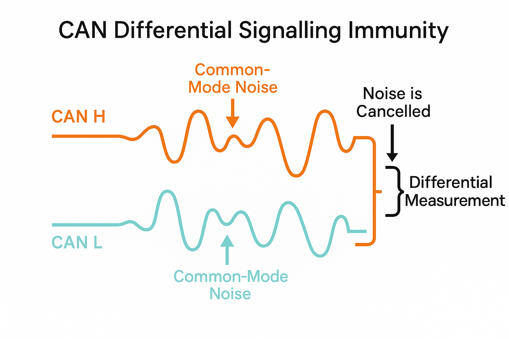

# CAN通信

CAN（Controller Area Network）は、自動車や産業機器で広く使用される堅牢な通信プロトコルです。高い信頼性、リアルタイム性、およびノイズ耐性を特徴とし、分散システムにおける制御通信に適しています。

## CAN通信とは
CAN通信は、1986年にボッシュ社によって開発された通信規格で、特に自動車の電子制御ユニット（ECU）間の通信用として設計されました。マルチマスター方式を採用し、優先度に基づくメッセージ調停機能を持つことが特徴です。

### 質問
1. CANはどのようなところで使われていますか？調べて3つほどの例を答えてください。

### 物理層
物理層は通信の電気的特性を定義する層で、信号の伝送方式や電気的な仕様を規定します。CAN通信では、差動信号による高いノイズ耐性を実現しています。

### 質問
1. 通信分野における階層モデルとはどのような考えなのか、またどうして階層モデルが用いられるのかを説明してください。

### Layer 1（物理層）

#### CAN通信の電気的特性
CAN通信の電気的特性は、信頼性の高い通信を実現するための重要な要素です。信号振幅は通常3.5V程度の差動電圧を使用し、ドミナント（論理0）状態とリセッシブ（論理1）状態を明確に区別します。この差動電圧方式により、外部ノイズの影響を大きく軽減しています。

### 質問
1. 「ドミナント」、「リセッシブ」という単語のスペルと意味を答えてください。

#### 平衡線路による伝送、CAN_H と CAN_L
CAN通信では、CAN_H（High）とCAN_L（Low）の2本の信号線を使用する平衡伝送方式を採用しています。両線の電圧差を利用することで、共通モードノイズを効果的に除去し、高い信頼性を確保しています。

差動対線（ツイストペア）の使用により、外部からの電磁干渉を最小限に抑え、長距離伝送でも安定した通信を実現します。Fig.1 は、差動対線による電磁干渉の抑制を示すものです。平行線路に同様の誘導起電力が生じても受信側で電位差から送信信号を求める際に、共通モードノイズ（Common Mode Noise）の影響を最小限に抑えることができます。

*Fig. 1 CAN Difference Signalling Immunity*

### 質問
1. 誘導起電力を説明してください。

#### トランシーバー（TX と RX）
CANトランシーバーは、CANコントローラーの論理信号レベルとCANバスの差動電圧レベルの間の変換を行う重要なコンポーネントです。送信（TX）時にはコントローラーからの論理信号を差動信号に変換し、受信（RX）時には差動信号を論理信号に変換します。

電気‐機械的インタフェースの入出力として、信号の整形やノイズ除去、保護機能なども備えています。

### 質問
1. TX、RXの「T」、「R」の由来を答えてください。

#### ドミナントとリセッシブ

バス電圧状態による論理 “0／1” の表現

#### シグナルコーディング、NRZ
CAN通信では、NRZ（Non-Return-to-Zero）方式を採用してビット伝送を行います。この方式では、1ビット期間中、信号レベルを維持し続けることで、効率的なデータ伝送を実現します。ただし、長時間同じビット値が続く場合の同期ずれを防ぐため、ビットスタッフィングという技術を併用しています。

ノンリターン・トゥ・ゼロ方式によるビット伝送は、クロック信号を別途必要とせず、データ信号のみでビット同期を実現できる利点があります。

### 質問
1. NRZ、RZの違いを図で説明してください。

#### 通信速度
CAN通信の速度は、使用環境や要件に応じて柔軟に設定できます。標準的なCANでは最高1Mbpsまでの通信速度をサポートし、高速CAN（CAN FD）では最大5Mbpsまでの高速通信が可能です。

ボーレート（最高 1 Mbps など）の設定は、バスの長さやノイズ環境を考慮して適切に選択する必要があります。一般的に、バス長が長くなるほど、最大通信速度は制限されます。

### Layer 2（データリンク層）

#### コントローラー

フレーミング、エラーチェック、再送制御などのロジック

#### CANバスとノード、マルチ・マスター方式

ネットワークトポロジーと任意ノードからの送信許可

#### バスの調停、CSMA/CA

ビット単位アービトレーションを含むアクセス制御

#### 同期、同期がずれた場合の調整の仕組み、ビットスタフィング

ビット同期維持（同期ビット／ビットスタッフィング）

 #### エラー検出

CANのデータリンク層（リンクレイヤー）にはビットモニタリングと ACK チェックのほかに、以下の３つのエラー検出機構が規定されており、合計５種類のメカニズムが存在します。

1. ビットモニタリング（Bit Monitoring）
送信ビットとバス上のビットを逐次比較し、不一致を検出する。

1. スタッフィングエラー（Stuff Error）
連続する同一ビットが５つを越えたときに挿入する“ビットスタッフィング”ルールの違反を検出する。

1. フレームフォーマットエラー（Form Error）
SOF／EOF／CRC デリミタなど、定義された固定ビットパターンが破られたときに検出する。 
Total Phase

1. CRC エラー（CRC Error）
受信側で再計算した CRC と送信側の CRC フィールドを比較し、不一致を検出する。

1. ACK チェック（Acknowledgement Check）
ACK スロットで受信ノードのドミナント応答が得られないときに検出する。

これらにより、ビットレベル／メッセージレベル双方で堅牢なエラー検出が実現されています。

 #### 封じ込め（Error Detection and Error Confinement）

CANプロトコルでは、異常ノードを自動的に排除する仕組みとして 「フォルトコンフィンメント機構（Error Confinement Mechanism）」 が定義されています。
この機構では各ノードが送受信エラーを検出すると内部のエラーカウンタ（TEC＝Transmit Error Counter、REC＝Receive Error Counter）を増減し、以下の３つの状態を自律的に遷移します。

1. Error Active
正常動作中の状態。エラー検出時には「アクティブエラーフレーム」を送出し、他ノードに通知。

1. Error Passive
軽微なエラーが累積した状態。エラー検出時には「パッシブエラーフレーム」を送出し、バスへの影響を最小限に抑制。

1. Bus-Off
重大なエラーが連続（TEC≥256）すると到達し、この状態ではノードはバスから完全に切り離され、以降通信に参加しなくなる 
Medium。

これにより、悪影響を及ぼす異常ノードをネットワークから排除し、システム全体の信頼性を維持します。

#### データの構造、データフレームとリモートフレーム

CANのデータフレーム（標準フォーマット／拡張フォーマット）は、以下のようなフィールド順・ビット構成で構成されています。

---

##### 1. 標準フォーマット（11bit ID）

| フィールド名                | ビット長 | 概要                                        |
| --------------------- | ---- | ----------------------------------------- |
| SOF                   | 1    | フレーム開始ビット（Dominant=0）                     |
| **Arbitration Field** |      |                                           |
| • Identifier          | 11   | メッセージ識別子                                  |
| • RTR                 | 1    | リモート送信要求ビット（Data Frame→0, Remote Frame→1） |
| • IDE                 | 1    | フォーマット識別（標準→0, 拡張→1）                      |
| • r0                  | 1    | 予備ビット（予約）                                 |
| **Control Field**     |      |                                           |
| • DLC                 | 4    | データ長コード（Data Length Code：0～8 バイト）         |
| **Data Field**        | 0–64 | 実データ（0～8 バイト×8bit=0～64bit）                |
| **CRC Field**         |      |                                           |
| • CRC Sequence        | 15   | CRC 検査値                                   |
| • CRC Delimiter       | 1    | CRC デリミタ（Recessive=1）                     |
| **ACK Field**         |      |                                           |
| • ACK Slot            | 1    | 受信ノードによる “Dominant=0” 応答                  |
| • ACK Delimiter       | 1    | ACK デリミタ（Recessive=1）                     |
| **EOF**               | 7    | フレーム終了ビット（全て Recessive=1）                 |
| **IFS**               | 3    | インターミッション（次フレームとの隙間：Recessive=1 が3ビット）    |

---

##### 2. 拡張フォーマット（29bit ID）

標準フォーマットとの違いは Arbitration Field の拡張部分のみです。

| フィールド名                | ビット長 | 備考                                        |
| --------------------- | ---- | ----------------------------------------- |
| SOF                   | 1    | 同上                                        |
| **Arbitration Field** |      |                                           |
| • Identifier (High)   | 11   | ID の上位 11bit                              |
| • SRR                 | 1    | Substitute Remote Request（必ず Recessive=1） |
| • IDE                 | 1    | フォーマット識別（標準→0, 拡張→1）                      |
| • Identifier (Low)    | 18   | ID の下位 18bit                              |
| • RTR                 | 1    | 拡張フレーム中の RTR                              |
| • r1、r0               | 2    | 予約ビット                                     |
| **Control Field**     | 4    | DLC                                       |
| **Data Field**        | 0–64 | 実データ                                      |
| **CRC Field**         | 15+1 | 同上                                        |
| **ACK Field**         | 2    | 同上                                        |
| **EOF**               | 7    | 同上                                        |
| **IFS**               | 3    | 同上                                        |

---

以上が CAN データフレームのビット構成です。標準／拡張ともに、物理層での差動送受信に先立ってこのリンク層フォーマットに従ってフレームを組み立て・解析します。

#### データ構造の戦略

多くのノードが必要とする重要なデータはデータフレームを流し続けて、各ノードは必要に応じて受信するようにします。この場合、バス上に置かれた共有メモリにアクセスするようなイメージです。「回転寿司」に例えた説明もあります。

https://monoist.itmedia.co.jp/mn/articles/0807/09/news140_2.html

リモートフレームによる呼び出しで他のノードのデータをデータフレームで取得する方法は分散コンピューティングのリモートプロシジャーコール(RPC)のイメージです。先のページでは「オーダーしてから料理が運ばれてくるレストラン」に例えています。

CANの伝送レートは最大1Mbps（CAN FDの場合は2Mbps、5Mbpsなど1Mbps以上）ですが、オープンハードウェアのESC(Electric Speed Controller)だと500kbpsがよく用いられているようです。

対象とする制御系の制御周期を短くすると500kbps、1Mbpsだと1周期におけるデータ量はそれほど多くとれません。そのため、1周期間に置くデータは慎重に設計する必要があるでしょう。

## CAN通信における構成要素

### CANコントローラー

CANコントローラーは、Controller Area Network (CAN) プロトコルを扱うデバイスで、ネットワーク内の**ノード**として機能します。ホストマイコンとのインターフェースを持ち、メッセージバッファやエラーマネジメントも担当します。主な役割として、ビットタイミング生成やトランシーバインターフェースなどがあります。スタンドアロン型とMCU内蔵型の違いもあり、**コントローラ**と**トランシーバ**の違いは、**コントローラ**が通信プロトコルを管理し、**トランシーバ**が物理層の電気信号を処理することです。

コントローラの例としてFig.2 にMicrochip SmartFusion 2 デバイスに含まれるコントローラーのブロックダイアグラムを示します。CANバスと信号の電気的な送受信はコントローラの外、左側にあるトランシーバーが担っています。コントローラーはトランシーバーとRX（受信）、TX（送信）のデジタル信号の送受信をおこなっています。コントロラーは送受信データをデータフレームとして準備したり、エラーの検出などを行います。MCUとのやりとりは右側の「APB_1 Bus」の部分で行われます。

CANノードには、ホストMCU、CANコントローラー、CANトランシーバーの3つの部品があります。MCUに統合されたCANでは、CAN周辺機器が**コントローラ**として機能し、ISO11898-1（データリンク層）の機能を実装します。これにはメッセージバッファリング、フレーミング、CRC、ビットタイミング、エラーチェック、バスアービトレーションが含まれます。**コントローラ**は、**トランシーバ**とTXD/RXDで接続されます。

*Fig.2 CAN Controller Block Diagram*
-- <cite>[Microchip, Figure 11-1. CAN Controller Block Diagram, 11 CAN Controller,  https://onlinedocs.microchip.com/oxy/GUID-199548F4-607C-436B-80C7-E4F280C1CAD2-en-US-1/GUID-57B9E96E-FD2D-4C9B-88F8-1DECDAE5978E.html]

### CANコントローラーとは何か

#### 1. ノードを構成する 3 つのレイヤ

一般的な CAN ノードは **(1) ホスト MCU/CPU**、**(2) CANコントローラー**、**(3) CANトランシーバー** で構成されます。

* **CANコントローラー**は ISO11898-1 で規定されるデータリンク層（フレーム生成・CRC・調停・エラーハンドラなど）の全機能をハードウェアで実装するブロックです。
* **CANトランシーバー**は ISO11898-2/-5 で規定される物理層を担当し、TXD/RXD のロジックレベルを差動信号（CAN H/L）に変換します。

> 「典型的な CAN ソリューションは、CAN プロトコルを実装する **CAN コントローラ**と、物理バスとのインタフェースを行う **CAN トランシーバ**で構成される」 ([Microchip][1])

#### 2. コントローラー内部の主要ブロック

ブロック図（上図）に示すように、一般的な CAN コントローラーは次の機能モジュールを持ちます。

| 機能ブロック                             | 役割                                                     |
| ---------------------------------- | ------------------------------------------------------ |
| **CAN Protocol Engine**            | ビットタイミング生成、スタッフィング、CRC 生成/チェック、エラー検出・バスオフ管理            |
| **Tx Handler / Prioritizer**       | 最大 3 〜 32 個程度の送信バッファ（メールボックス）を優先度付きで仲裁                 |
| **Rx Handler & Acceptance Filter** | 受信バッファとマスク/フィルタ（ID・データ先頭 2 byte 等）によるハードウェア受信フィルタリング   |
| **Interrupt Controller**           | 送受信完了、エラー、バスステータスなどをホストに割り込み通知                         |
| **Clock / Bit-Time 設定レジスタ**        | PCLK から Nominal / Data bit rate を分周し、サンプルポイントや SJW を設定 |
| **SPI / APB / AHB インタフェース**        | ホスト MCU からレジスタアクセス（スタンドアロン品は SPI、内蔵型はメモリマップド）          |

#### 3. 実装形態のバリエーション

| 形態                      | 代表デバイス                                                               | 特徴                                           |
| ----------------------- | -------------------------------------------------------------------- | -------------------------------------------- |
| **スタンドアロン CAN コントローラー** | Microchip **MCP2515** (SPI), Renesas **R-CAN** IP の外付け版など            | 既存 MCU に SPI 接続で追加できる。電源・クロック独立。             |
| **MCU 内蔵 CAN ペリフェラル**   | NXP **LPC55xx FlexCAN**, TI **TMS320F2807 MCAN**, STM32 **FDCAN** など | レジスタ直結でレイテンシが低い。DMA 併用で負荷が小さい。               |
| **コントローラー + トランシーバ一体型** | Microchip **MCP25625**, TI **TCAN4550**                              | 基板面積削減・EMC最適化。SPI だけで “ほぼ CAN モジュール” を外付け可能。 |

#### 4. コントローラーが担うプロトコル機能

1. **フレーム生成／解析**
   SOF〜EOF までの各フィールドを NRZ で出力し、ビットスタッフィングも自動計算。
2. **多重化アクセス（CSMA/CD＋AMP）**
   送信中に劣勢ビット（リセッシブ）を優勢ビット（ドミナント）で上書きされると送信を中止し、他ノードの優先度を尊重。
3. **エラーハンドリング**
   CRC、フォーム、スタッフ、ビットエラーなど 5 種類を検出し、**TEC/REC カウンタ**をハードウェアで管理。バスオフ復帰も自動（またはソフト制御）。
4. **受信フィルタリング**
   最大 32 個程度の **マスク＋フィルタ**で対象 ID だけをバッファに取り込み、ホスト割込みを最小化。
5. **CAN-FD / ISO CAN-FD（MCAN）拡張**
   データフェーズで 2〜8 Mbps へ引き上げる高速ビットタイミングと 64 バイトデータ長をサポートするコアも登場。

#### 5. トランシーバとのインタフェース

* **TXD (Controller → Transceiver)** : ロジック 0/1 をドミナント/レセッシブへ変換。
* **RXD (Transceiver → Controller)** : バスの差動状態をロジック 0/1 に復元。
  トランシーバは ±58 V のバッテリサージや EMC を吸収し、コントローラーはロジック電圧 (3.3 V/5 V) のみで動作するのが一般的です。 ([TI E2E][2])

#### 6. 社内教育で押さえるポイント

1. **コントローラー＝データリンク層、トランシーバ＝物理層**という役割分担を明確に。
2. ビットタイミング（サンプルポイント, SJW）の設定値は**コントローラーのレジスタ**で調整する。
3. フィルタリングはハード側で行えば MCU 負荷を劇的に減らせる。
4. CAN-FD 対応では **MCAN**（Bosch IP）と従来 CAN のレジスタ構造が大きく異なるため、教育資料を分ける。
5. **スタンドアロン vs 内蔵 vs 一体型**の選定要件（コスト、サイズ、EMC）を事例で示すと理解が進む。

---

参考資料

* Microchip「MCP25625 Data Sheet」p.3–4 ― スタンドアロン＋トランシーバ一体型のブロック図と“典型的な CAN ソリューション”の定義 ([Microchip][1])
* TI Application Report「Introduction to the Controller Area Network (CAN)」SLOA101B ― CAN プロトコルの CSMA/CD+AMP アービトレーション解説 ([TI.com][3])
* TI E2E Forum「Difference between CAN transceiver and controller」― コントローラーとトランシーバの役割区分 ([TI E2E][2])

[1]: https://ww1.microchip.com/downloads/en/DeviceDoc/MCP25625-CAN-Controller-Data-Sheet-20005282C.pdf "MCP25625 CAN Controller with Integrated Transceiver Data Sheet"
[2]: https://e2e.ti.com/support/interface-group/interface/f/interface-forum/900475/difference-between-can-transceiver-and-controller?utm_source=chatgpt.com "Difference between Can transceiver and controller - Interface forum"
[3]: https://www.ti.com/lit/pdf/sloa101?utm_source=chatgpt.com "[PDF] Introduction to the Controller Area Network (CAN) - Texas Instruments"

### CANトランシーバー

### コネクタ

### 線路

### 終端抵抗（ターミネーター）

## ArduinoとCAN通信

### Arduino公式のCANライブラリ

Arduino公式のボードでCANをサポートしているのはArduino Uno R4などのRenesasのMCUを採用したボードかMKR CAN Shieldのみです。前者の場合、MCU内蔵のCANコントローラーを用いることができますが、トランシーバーは別途用意する必要があります。後者はコントローラーMCP2515とトランシーバーTJA1049が搭載されているので直接CANバスに接続することができます。

ESP32シリーズのMCUにもCANコントローラーが内蔵されていますが、公式ライブラリとの互換性はないため別のライブラリを用いる必要があります。

https://docs.arduino.cc/learn/communication/can/
https://docs.arduino.cc/hardware/mkr-can-shield/

### ESP32 TWAI Driver

Espressif公式のArduino ESP32ドキュメントではTWAIについてはArduino APIでサポートされていないと述べられています。

https://docs.espressif.com/projects/arduino-esp32/en/latest/libraries.html

しかし、ESP32のボードライブラリに付属しているスケッチ例にはESP32>TWAI>TWAIreceive、TWAItransmitがあります。これらはESP32の公式SDKであるESP-IDFのペリフェラルドライバをそのまま呼び出しているようです。

このようにArduinoからの利用についてはサポート対象外とされていますが、Arduino APIと干渉しない限りではTWAI Driverを用いることでArduion ESP32でもTWAIを利用することができます。

https://github.com/espressif/arduino-esp32/tree/master/libraries/ESP32/examples/TWAI

## 課題

### 課題3

#### 課題3.1

Espressif ESP32C3はCANコントローラ、CANトランシーバーを内蔵しているか否かを調べ、答えなさい。同MCU以外でCANコントローラーを内蔵しているMCUを採用しているArduino互換ボードを二つ以上、探し、答えなさい。

#### 課題3.2    

二つのノードで以下の処理を100ms毎に行うスクリプトを実行し、エラー発生頻度を観察しなさい。
 
1. 32bitのカウントアップ
1. カウンターの値をデータフレームで発出
1. 他のノードの値を読み取る
1. 他のノードの読み取り値が飛び値だった場合は読み取りデータエラーを表示

#### 課題3.3

二つのノードで以下の処理を10ms毎に行うスクリプトを実行し、エラー発生頻度を観察しなさい。

1. ノード1ではスロットル開度の値を読み取りCANデータフレームとして発出する。
1. ノード2ではCANデータフレームからスロットル開度の値を読み取り、LEDディスプレイに表示する。

## CAN通信の仕組み・波形・信号レベルに関する参考資料

参考文献・出典一覧（各資料のURLとタイトル）：

Vector Japan: [はじめてのCAN/CAN FD](https://www.keyence.co.jp/ss/products/recorder/lab/candata/base.jsp#:~:text=CAN%E3%81%AE%E6%88%90%E3%82%8A%E7%AB%8B%E3%81%A1)

Keyence 計測器ラボ: [CANとは？](https://www.keyence.co.jp/ss/products/recorder/lab/candata/base.jsp#:~:text=CAN%E3%81%AE%E6%88%90%E3%82%8A%E7%AB%8B%E3%81%A1)

CQ出版 トランジスタ技術: [CANの基礎知識](https://www.keyence.co.jp/ss/products/recorder/lab/candata/base.jsp#:~:text=CAN%E3%81%AE%E6%88%90%E3%82%8A%E7%AB%8B%E3%81%A1)

Keyence 計測器ラボ: [CANデータ通信の仕組み](https://www.keyence.co.jp/ss/products/recorder/lab/candata/mechanism.jsp#:~:text=CAN%E9%80%9A%E4%BF%A1%E3%81%AE%E5%9F%BA%E6%9C%AC%E3%80%8C%E3%83%89%E3%83%9F%E3%83%8A%E3%83%B3%E3%83%88%E3%80%8D%E3%81%A8%E3%80%8C%E3%83%AC%E3%82%BB%E3%82%B7%E3%83%96%E3%80%8D)

CQ出版 書籍抜粋: [『動かして学ぶCAN通信』](https://www.cqpub.co.jp/hanbai/books/42/42141/42141.pdf#:~:text=CAN%E3%83%90%E3%82%B9%E3%81%AE%E4%BF%A1%E5%8F%B7%E7%8A%B6%E6%85%8B%E3%81%AB%E3%81%AF%E5%9B%B31,%E3%81%A8%E3%81%84%E3%81%84%E3%81%BE%E3%81%99%EF%BC%8E%E3%83%89%E3%83%9F%E3%83%8A%E3%83%B3%E3%83%88%E3%81%AF%E4%BF%A1%E5%8F%B7%E3%81%8C%E3%82%A2%E3%82%AF%E3%83%86%E3%82%A3%E3%83%96%E3%81%A7%E3%81%82%E3%82%8B%EF%BC%8C%E3%83%AA%E3%82%BB%E3%83%83%E3%82%B7%E3%83%96%E3%81%AF%E9%9D%9E%E3%82%A2%E3%82%AF%E3%83%86%E3%82%A3%E3%83%96%EF%BC%88%E3%82%A2%E3%82%A4%E3%83%89%E3%83%AB%EF%BC%89%E3%81%A7%E3%81%82%E3%82%8B%EF%BC%8C)

Analog Devices アナログDialoque: [CANの差動出力信号レベル調整を実現するシンプルな回路](https://www.cqpub.co.jp/hanbai/books/42/42141/42141.pdf#:~:text=CAN%E3%83%90%E3%82%B9%E3%81%AE%E4%BF%A1%E5%8F%B7%E7%8A%B6%E6%85%8B%E3%81%AB%E3%81%AF%E5%9B%B31,%E3%81%A8%E3%81%84%E3%81%84%E3%81%BE%E3%81%99%EF%BC%8E%E3%83%89%E3%83%9F%E3%83%8A%E3%83%B3%E3%83%88%E3%81%AF%E4%BF%A1%E5%8F%B7%E3%81%8C%E3%82%A2%E3%82%AF%E3%83%86%E3%82%A3%E3%83%96%E3%81%A7%E3%81%82%E3%82%8B%EF%BC%8C%E3%83%AA%E3%82%BB%E3%83%83%E3%82%B7%E3%83%96%E3%81%AF%E9%9D%9E%E3%82%A2%E3%82%AF%E3%83%86%E3%82%A3%E3%83%96%EF%BC%88%E3%82%A2%E3%82%A4%E3%83%89%E3%83%AB%EF%BC%89%E3%81%A7%E3%81%82%E3%82%8B%EF%BC%8C)

Keyence 計測器ラボ: [CANプロトコル基礎](https://www.keyence.co.jp/ss/products/recorder/lab/candata/protocol.jsp#:~:text=%E3%83%90%E3%82%B9%E3%81%AE%E7%8A%B6%E6%85%8B%20%E3%83%AC%E3%82%BB%E3%83%83%E3%82%B7%E3%83%96%EF%BC%881%EF%BC%89%20%E3%83%89%E3%83%9F%E3%83%8A%E3%83%B3%E3%83%88%EF%BC%880%EF%BC%89%20Min,00)

Texas Instruments: [EMC最適化設計、高速CANトランシーバ](https://www.keyence.co.jp/ss/products/recorder/lab/candata/protocol.jsp#:~:text=%E3%83%90%E3%82%B9%E3%81%AE%E7%8A%B6%E6%85%8B%20%E3%83%AC%E3%82%BB%E3%83%83%E3%82%B7%E3%83%96%EF%BC%881%EF%BC%89%20%E3%83%89%E3%83%9F%E3%83%8A%E3%83%B3%E3%83%88%EF%BC%880%EF%BC%89%20Min,00)
