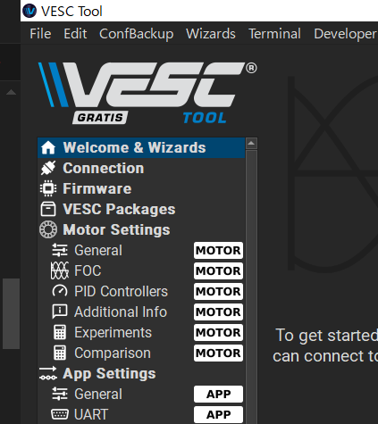
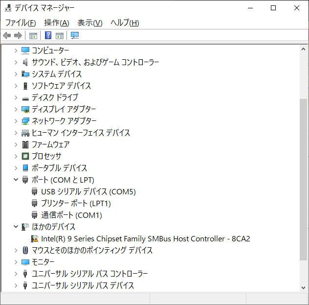

# 開発環境

## Arduino IDEのインストール
Arduino IDEのインストール方法を説明します。

Download and install Arduino IDE：https://support.arduino.cc/hc/en-us/articles/360019833020-Download-and-install-Arduino-IDE

## M5Stackのボードサポートの追加
Arduino IDEのボードサポートを追加する方法を説明します。

Setting Up the Arduino Development Environment：https://docs.m5stack.com/ja/arduino/arduino_ide

## ライブラリのインストール
Arduino IDEのライブラリをインストールする方法を説明します。

Installing Libraries：https://docs.arduino.cc/software/ide-v1/tutorials/installing-libraries/

## COMポートの設定
Arduino IDEのCOMポートを設定する方法を説明します。

WindowsでCOMポートを確認する方法：

1. デバイスマネージャーを起動します。
1. 「ポート（COMとLPT）」を展開します。
1. COMポート番号を確認します。

Arduino IDEでCOMポートを設定する方法：

1. タスクバーの検索ボックスに「デバイスマネージャー」を入力すると「デバイスマネージャーが候補として表示されます。これを起動します。

1. 「ポート（COMとLPT）」を展開します。

1. COMポート番号を確認します。

COMポート番号が目的のボードのものか確認するにはデバイスマネージャーでCOMポートを表示している状態で、ボードのUSBケーブルを挿抜をして現れたり消えたりするを見ましょう。

## シリアルモニターの起動
Arduino IDEのシリアルモニターを起動する方法を説明します。

